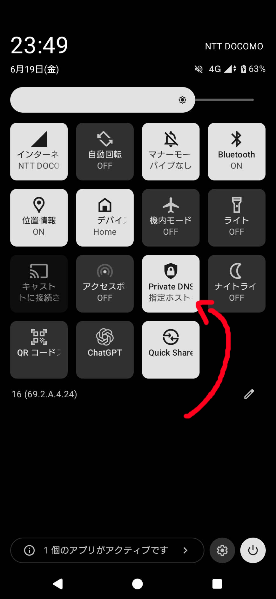

# Private DNS Switch

英語のREADMEは日本語の下にあります。

The English README is below the Japanese README.

---

## 日本語

Androidのクイック設定パネルにPrivate DNSをオン・オフするためのタイルを追加するための雑なアプリです。

いちいち設定画面に潜ってオン・オフするのが面倒だったので作りました。

### できること

- クイック設定タイルのタップでPrivate DNSをON/OFF
- ON時は直近の有効設定を復元
  - 指定ホスト名モードをOFFにした場合は、そのホスト名を次回ON時に復元
  - 復元できるホスト名がない場合は「自動」モードでON
- クイック設定タイルの長押しでPrivate DNS設定画面を開く
- アプリ画面から現在の状態確認、Private DNS設定画面の起動



### 対応環境

- Android 9 (API 28) 以上
- `adb shell pm grant` で `WRITE_SECURE_SETTINGS` を付与できる端末
  - Androidのグローバル設定を書き換える挙動をするため、ADBで権限付与してます

### インストール方法

1. このリポジトリをcloneします。

```sh
git clone git@github.com:sark-oji/android-private-dns-switch.git
cd android-private-dns-switch
```

2. デバッグAPKをビルドします。

```sh
./gradlew assembleDebug
```

Windows PowerShellでは以下を使います。

```powershell
.\gradlew.bat assembleDebug
```

3. USBデバッグを有効にした端末を接続し、APKをインストールします。

```sh
adb install -r app/build/outputs/apk/debug/app-debug.apk
```

4. `WRITE_SECURE_SETTINGS` を付与します。

```sh
adb shell pm grant dev.sarkoji.privatednsswitch android.permission.WRITE_SECURE_SETTINGS
```

5. 端末のクイック設定編集画面を開き、`Private DNS` タイルを追加します。

### 使い方

- タイルをタップ: Private DNSをON/OFFします。
- タイルを長押し: Private DNS設定画面を開きます。
- 権限未付与の状態でタイルをタップ: アプリ画面を開き、必要なADBコマンドを表示します。

### 実装メモ

Androidの公開APIにはPrivate DNS専用の通常権限がないため、アプリは以下のグローバル設定キーを書き換えます。

- `private_dns_mode`
- `private_dns_specifier`

長押し時の設定画面起動は、端末が対応していれば `android.settings.PRIVATE_DNS_SETTINGS` を使い、対応していない場合はネットワーク設定、通常設定の順にフォールバックします。

### ライセンス

このプロジェクトはMIT Licenseで公開します。

アプリコードとリソースはこのプロジェクト用に作成したものです。現在のデバッグAPKには、Android Gradle Pluginのツールチェーン経由でKotlin standard library関連の成果物が含まれます。これらはApache License 2.0でライセンスされています。詳細は [THIRD_PARTY_NOTICES.md](THIRD_PARTY_NOTICES.md) を参照してください。

Android Gradle Plugin、Gradle、Android SDKなどのビルド時ツールは、それぞれの提供元ライセンスに従います。

---

## English

Private DNS Switch is a rough little Android app that adds a Quick Settings tile for toggling Private DNS on and off.

I made it because digging into Android settings every time was annoying.

### Features

- Tap the Quick Settings tile to toggle Private DNS on or off.
- Restore the last enabled Private DNS configuration when turning it back on.
  - If hostname mode was enabled, the hostname is restored.
  - If no hostname is available, Private DNS is enabled in automatic mode.
- Long-press the Quick Settings tile to open the Android Private DNS settings screen.
- Open the app to check the current status or jump to Private DNS settings.


### Requirements

- Android 9 (API 28) or later
- A device where you can grant `WRITE_SECURE_SETTINGS` with `adb shell pm grant`
  - The app writes Android global settings, so this permission must be granted with ADB.

### Installation

1. Clone this repository.

```sh
git clone git@github.com:sark-oji/android-private-dns-switch.git
cd android-private-dns-switch
```

2. Build a debug APK.

```sh
./gradlew assembleDebug
```

On Windows PowerShell, use:

```powershell
.\gradlew.bat assembleDebug
```

3. Connect your Android device with USB debugging enabled, then install the APK.

```sh
adb install -r app/build/outputs/apk/debug/app-debug.apk
```

4. Grant `WRITE_SECURE_SETTINGS`.

```sh
adb shell pm grant dev.sarkoji.privatednsswitch android.permission.WRITE_SECURE_SETTINGS
```

5. Open Android's Quick Settings edit screen and add the `Private DNS` tile.

### Usage

- Tap the tile: toggles Private DNS on or off.
- Long-press the tile: opens the Android Private DNS settings screen.
- Tap the tile without the required permission: opens the app screen with the ADB command.

### Implementation Notes

Android does not expose a normal app permission dedicated to Private DNS toggling, so this app writes these global settings:

- `private_dns_mode`
- `private_dns_specifier`

For the long-press action, the app first tries `android.settings.PRIVATE_DNS_SETTINGS`, then falls back to wireless settings and general settings when needed.

### License

This project is licensed under the MIT License.

The app code and resources are original to this project. The debug APK currently includes Kotlin standard library artifacts brought in by the Android Gradle Plugin toolchain; those artifacts are licensed under Apache License 2.0. See [THIRD_PARTY_NOTICES.md](THIRD_PARTY_NOTICES.md) for details.

Build-time tools such as the Android Gradle Plugin, Gradle, and the Android SDK remain governed by their own licenses.
